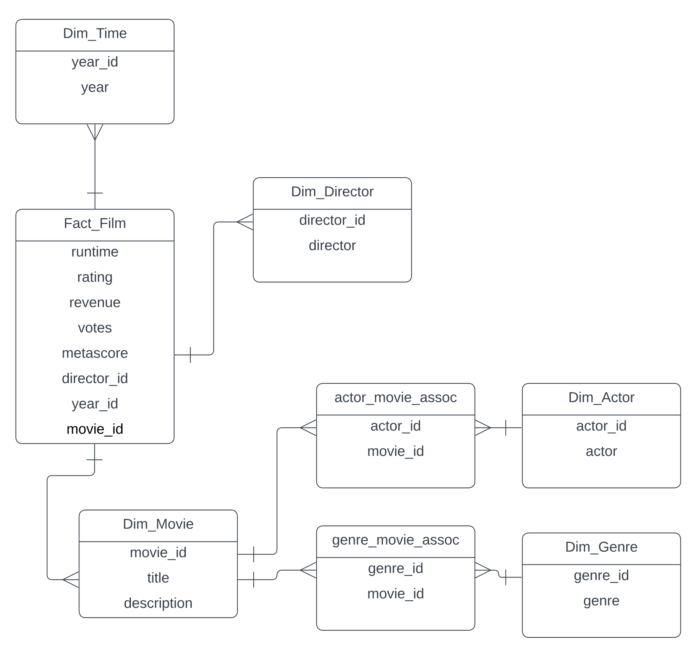

# Azure Data Factory Movie Data Pipeline

## Overview

This Azure Data Factory (ADF) project is designed to process a movie dataset and create a star schema of dimensional tables and a fact table using Azure Data Factory Data Flows. The project follows a data architecture that includes landing, mapping, and staging tables to ensure efficient data processing and maintain data integrity.

## Data Model

## Project Structure

The project is organized as follows:

- **Landing**: This is where the raw movie data is initially ingested.
- **Mapping**: This is the internal tracking system to keep track of surrogate keys
- **Staging**: This is the temporary storage for data before it's cleaned, transformed, and loaded into a target database. Ensures data quality and separation from source and target systems. 
- **Star Schema**: This is where the dimensional tables and fact table are loaded to support analytical queries.

## Features

- **Data Transformation**: Data transformations are performed during the mapping stage to ensure data accuracy and consistency.
- **Data Quality**: The data flows are designed so that multiple runs will not add duplicate data to the database. It will also detect changes to the landing table and apply said changes correctly. 

## Pipelines

- **1 extract**: 
  - Data flows: load_landing
- **2 load map**: 
  - Data flows: - load_map_actor
                - load_map_genre
                - load_map_dir
                - load_map_year
                - load_map_film
- **3 load stg**:
  - Data flows: - load_stg_actor
                - load_stg_actor_film_assoc
                - load_stg_genre
                - load_stg_genre
                - load_stg_fim
- **4 load dim**:
  - Data flows: - load_dim_movie
                - load_dim_genre
                - load_dim_genre_movie_assoc
                - load_dim_actor
                - load_dim_actor_movie_assoc
                - load_dim_dir
                - load_dim_year
- **5 load fact**:
  - Data flows: - load_fact_film
- **pipelines 2_3_4_5**: This pipeline runs pipelines 2, 3, 4, and 5

  ## Database setup:

  - Star_schema_Movie_Data_Set.sql

